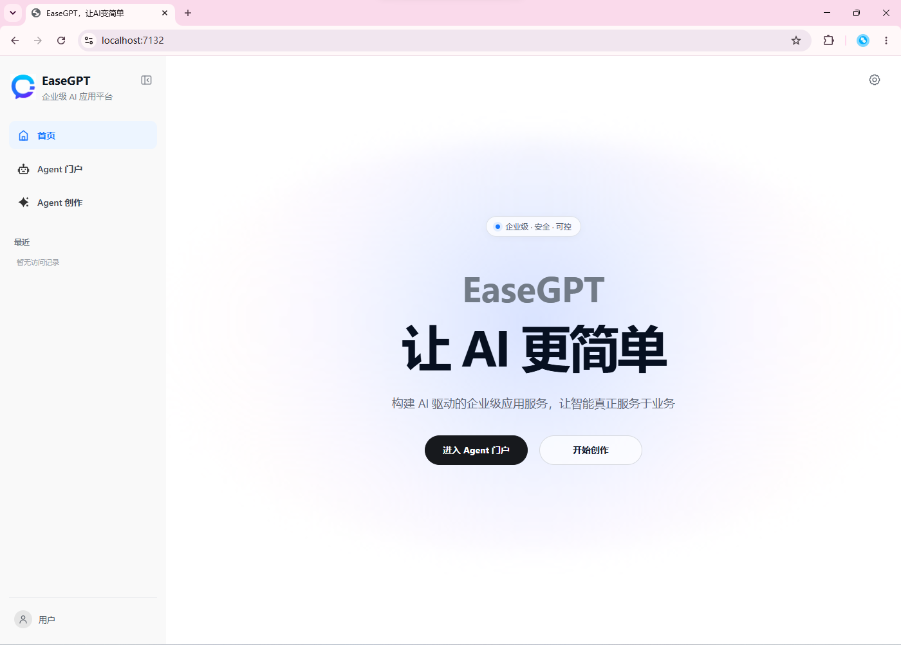
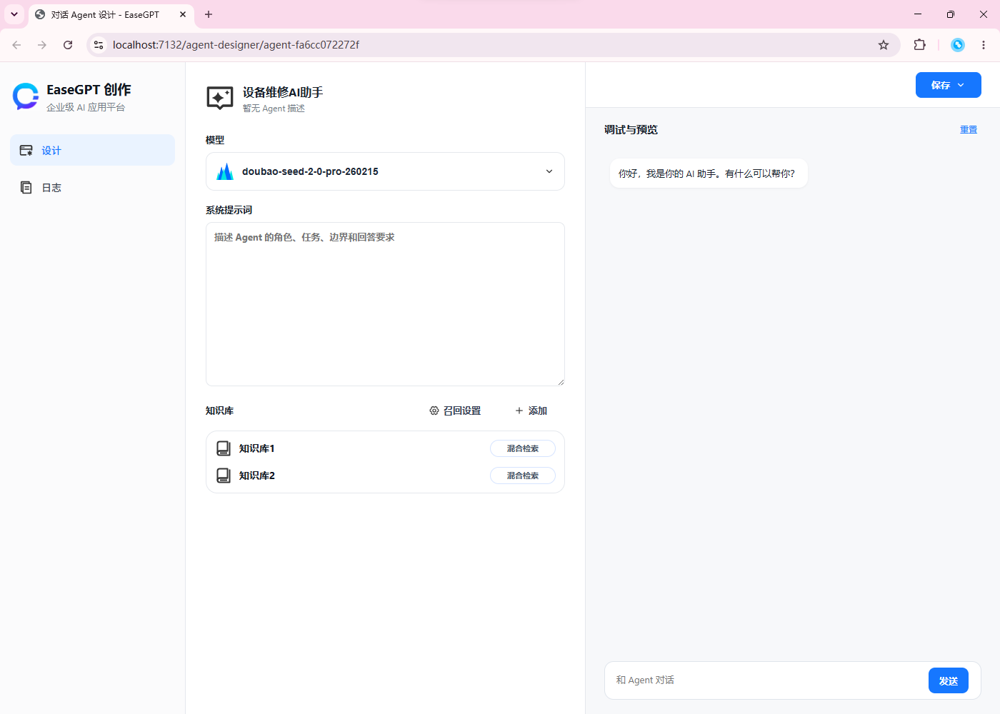
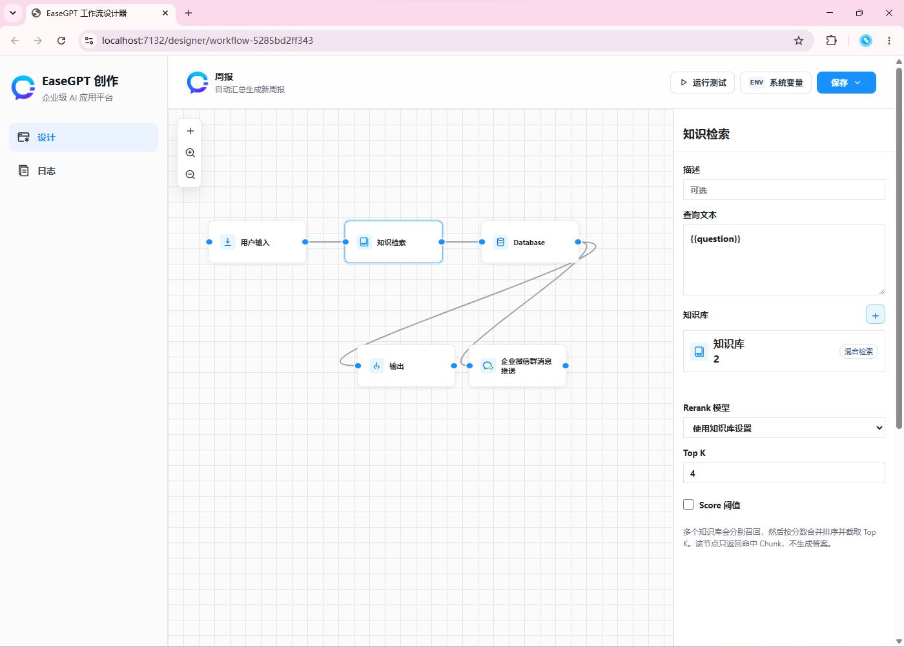
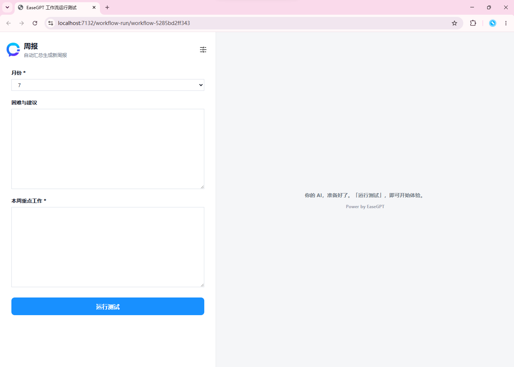

# EaseGPT ，让 AI 更简单。

5分钟快速构建知识库、Agent 与 AI 工作流的现代化开发平台。

基于 .NET 构建，支持多模型接入、可视化编排、自动化任务与企业级扩展能力，帮助团队快速打造真正可落地的 AI 应用。

[](LICENSE)

<p align="center">
  
  
</p>
<p align="center">
  
  
</p>

## 5 分钟快速部署

### 1. 下载并解压

1. 打开项目 GitHub 页面的 **Releases**。
2. 在最新版本的 **Assets** 中下载与操作系统和 CPU 架构匹配的压缩包。
3. 将压缩包完整解压到具有写入权限的目录，例如 `D:\EaseGPT` 或 `/opt/easegpt`。

如果下载的是框架依赖版本，需要安装
[ASP.NET Core Runtime 10](https://dotnet.microsoft.com/download/dotnet/10.0)；标注为
`self-contained` 的独立版本无需安装 .NET。

### 2. 配置存储

打开发布目录中的 `appsettings.json`。默认配置无需外部数据库，可以直接使用：

```json
{
  "LiteDb": {
    "DatabasePath": "Data/easegpt.db"
  },
  "Rag": {
    "StoragePath": "Data/knowledge-files",
    "LanceDbPath": "Data/lancedb"
  }
}
```

这些相对路径都基于 EaseGPT 发布目录。请确保运行账户对发布目录及 `Data` 目录具有读写权限。首次启动会自动创建数据库、知识库文件和向量数据目录。

### 3. 启动服务

Windows Release 包：

```powershell
cd D:\EaseGPT
.\EaseGPT.exe --urls http://0.0.0.0:5146
```

框架依赖包，或压缩包中只提供 `EaseGPT.dll` 时：

```bash
cd /opt/easegpt
dotnet EaseGPT.dll --urls http://0.0.0.0:5146
```

看到 `Now listening on: http://0.0.0.0:5146` 后，在服务器本机访问：

```text
http://localhost:5146/
```

从其他电脑访问时，使用服务器 IP，例如 `http://192.168.1.10:5146/`，并确认系统防火墙已放行 TCP `5146` 端口。

### 4. 配置模型

1. 打开 EaseGPT，进入 Studio 的 **AI 模型配置**。
2. 添加 LLM、Embedding 或 Rerank 模型。
3. 填写模型 ID、Endpoint 和 API Key，启用配置后即可在 Agent、工作流和知识库中选择。

本地知识库默认可以使用 `local-hash` Embedding 完成基础测试；LLM、在线 Embedding 和 Rerank 功能需要配置对应的模型服务。通过页面保存的模型配置存储在 `Data/easegpt.db` 中。

开发环境不要把真实 API Key 写入并提交到 `appsettings.json`。推荐使用 .NET User Secrets：

```powershell
dotnet user-secrets set "Rag:Embedding:ApiKey" "你的 Embedding API Key"
dotnet user-secrets set "Rag:Chat:ApiKey" "你的 Chat API Key"
```

也可以通过环境变量配置，例如 `Rag__Embedding__ApiKey` 和 `Rag__Chat__ApiKey`。项目已忽略 `Data` 运行数据、本地配置、`.env`、诊断日志和本机构建目录；其中仅公开所需的 `Data/model-metadata.json` 会进入版本库。

### 5. 升级与生产使用

- 升级前停止 EaseGPT，并备份整个 `Data` 目录和 `appsettings.json`。
- 解压新版本后保留原有 `Data` 目录，再重新启动服务。
- 不要将 API Key、`Data` 数据库或知识库文件提交到公开仓库。
- 公网部署建议使用 Nginx、Caddy 或 IIS 配置 HTTPS、域名和反向代理，不要直接暴露管理端口。

## 功能概览

- 支持工作流图执行：节点负责处理逻辑，连线负责控制流转。
- 支持手动触发和定时触发。
- 支持 LiteDB 持久化工作流、执行记录和 LLM 供应商配置。
- 支持节点输入、输出、状态、耗时和错误记录。
- 支持通用 LLM Chat 节点，可接入 OpenAI-compatible 协议的模型供应商。
- 支持集中管理 LLM API Key、模型 ID、Endpoint 等配置，工作流节点只引用配置 ID。
- 支持本地 RAG 知识库：文件上传、后台解析切块、LanceDB 向量检索、关键词重排、上下文扩展、模型回答和引用来源。

## 本地 RAG 知识库

知识库元数据和分段保存在 LiteDB，原文件保存在 `Data/knowledge-files`，向量保存在 `Data/lancedb`。默认使用无需外部服务的 `local-hash` Embedding 和 `extractive` 回答模式，安装后即可跑通完整链路。生产使用时，在 `appsettings.json` 的 `Rag` 节点将 Embedding 和 Chat 的 `Provider` 改为 `openai-compatible`，并配置 Endpoint、Model、ApiKey；OpenAI、Azure OpenAI（兼容端点）、Ollama、DeepSeek 和通义千问均可通过同一抽象接入。

当前内置解析格式：`txt`、`md`、`csv`、`json`、`xml`、`html`、`docx`，单文件默认上限 100 MB。摄取任务由 `BackgroundService + Channel` 处理，服务重启后会自动续跑 Pending/Processing 文档。

主要 API：

```http
POST   /api/knowledge-bases
GET    /api/knowledge-bases/{id}
DELETE /api/knowledge-bases/{id}
POST   /api/knowledge-bases/{id}/documents               # multipart/form-data: file
GET    /api/knowledge-bases/{id}/documents/{documentId}
POST   /api/knowledge-bases/{id}/documents/{documentId}/retry
DELETE /api/knowledge-bases/{id}/documents/{documentId}
POST   /api/knowledge-bases/{id}/ask                      # { "question": "...", "topK": 5 }
```

问答响应包含 `answer` 与 `citations`；每条引用带文档 ID、文件名、分段序号、标题、原文摘录和综合相关度。

## 项目结构

整体分层和扩展规则参见 [ARCHITECTURE.md](ARCHITECTURE.md)。

- `Controllers/`：REST API 控制器。
- `Workflows/Domain/`：工作流、节点、连线和执行记录模型。
- `Workflows/Execution/`：图执行器、节点上下文、执行请求和节点结果。
- `Workflows/Nodes/`：内置节点和节点注册表。
- `Workflows/Nodes/Llm/`：通用 LLM Chat 节点、供应商注册表和供应商适配器。
- `Workflows/Scheduling/`：定时触发后台服务。
- `Workflows/Storage/`：LiteDB 存储、执行日志和数据迁移。

## 存储

系统使用 LiteDB 保存工作流定义、执行记录和 LLM 供应商配置。

默认数据库路径：

```text
Data/easegpt.db
```

可在 `appsettings.json` 中修改：

```json
{
  "LiteDb": {
    "DatabasePath": "Data/easegpt.db"
  }
}
```

## 内置节点

- `trigger.manual`：手动触发节点。
- `trigger.schedule`：定时触发节点，支持固定秒数间隔和带时区的标准 5 段 Cron 表达式。
- `data.template`：选择流程变量或使用支持 `{{变量}}` 的自定义内容作为最终输出，未选择时输出全部数据。
- `integration.http-request`：调用 HTTP 接口，支持请求参数、自定义请求头、变量模板、超时和失败重试。
- `integration.database`：连接 SQL Server、MySQL 或 PostgreSQL，执行参数化查询或数据更新。
- `integration.wecom-message`：通过企业微信群机器人 Webhook 推送文本消息。
- `ai.llm-chat`：通用 LLM 对话节点，支持供应商配置、消息和文件。
- `ai.question-classifier`：使用大模型识别问题分类并选择工作流分支。

## LLM 供应商配置

LLM 的 API Key、模型 ID、Endpoint、默认温度等信息单独保存在 LiteDB 中。工作流节点通常只需要引用 `providerConfigId`，避免每条工作流重复保存密钥和模型参数。

默认会创建两个配置：

- `doubao-default`：豆包，模型 `doubao-seed-2-0-pro-260215`。
- `qwen-default`：千问，模型 `qwen-plus`。

管理接口：

```http
GET /api/llm-provider-configs
GET /api/llm-provider-configs/doubao-default
PUT /api/llm-provider-configs/doubao-default
```

保存豆包配置示例：

```json
{
  "name": "Doubao Seed 2.0 Pro",
  "provider": "doubao",
  "model": "doubao-seed-2-0-pro-260215",
  "apiKey": "你的豆包 API Key",
  "temperature": 0.7,
  "enabled": true
}
```

## 通用 LLM Chat 节点

`ai.llm-chat` 节点只处理工作流配置、消息和文件输入；具体 HTTP 协议由供应商适配器负责。

节点配置示例：

```json
{
  "providerConfigId": "doubao-default",
  "messages": [
    { "role": "system", "content": "你是一个简洁可靠的中文助手。" },
    { "role": "user", "content": "{{question}}" }
  ],
  "filesInputKey": "files"
}
```

支持的供应商预设：

- `openai`：OpenAI Chat Completions 兼容接口。
- `qwen`：阿里云 DashScope OpenAI-compatible 模式。
- `doubao`：火山引擎 Ark OpenAI-compatible 接口。
- `custom-openai-compatible`：自定义 OpenAI-compatible 网关。

运行时可以传入消息和文件：

```json
{
  "triggerNodeId": "manual",
  "input": {
    "question": "请总结下面的文件内容。",
    "files": [
      {
        "name": "notes.txt",
        "mimeType": "text/plain",
        "text": "这里是文件正文。"
      },
      {
        "name": "diagram.png",
        "mimeType": "image/png",
        "url": "https://example.com/diagram.png"
      }
    ]
  }
}
```

文本文件会作为文本消息追加给模型。图片文件如果提供 `url` 或 `base64`，会按 OpenAI-compatible 的 `image_url` 内容发送；默认使用 `detail: "high"`，以尽量提高图片识别精度。实际是否支持取决于所选模型能力。

## 执行工作流

可以直接使用内置前端调用台：

```text
http://localhost:5146/
```

也可以用独立运行页访问指定流程：

```text
http://localhost:5146/ai/{workflowId}
https://localhost:7132/ai/{workflowId}
```

调用台支持：

- 选择现有工作流。
- 选择触发节点。
- 输入文本问题。
- 上传多个文本文件和图片文件。
- 点击执行后调用 `/api/workflows/{id}/execute/stream`，实时显示每一步节点状态。
- 查看每一步节点的输入、输出、状态和错误信息。

执行工作流：

```http
POST /api/workflows/{workflowId}/execute
Content-Type: application/json
```

最小请求体：

```json
{
  "triggerNodeId": "manual",
  "input": {
    "question": "请用三句话介绍这个工作流系统。"
  }
}
```

带文件请求体：

```json
{
  "triggerNodeId": "manual",
  "input": {
    "question": "请根据文件内容回答问题。",
    "files": [
      {
        "name": "notes.txt",
        "mimeType": "text/plain",
        "text": "EaseGPT 支持工作流编排、定时任务、LiteDB 存储和通用 LLM 节点。"
      }
    ]
  }
}
```

## 查看执行记录

查看某条工作流的执行记录：

```http
GET /api/workflows/{workflowId}/executions
```

查看全部执行记录：

```http
GET /api/executions
```

每个节点都会记录输入、输出、输出端口、状态、开始时间、结束时间和错误信息：

```json
{
  "nodeId": "output",
  "nodeName": "Output LLM info",
  "nodeType": "data.template",
  "status": "Succeeded",
  "input": {
    "question": "请介绍这个系统",
    "llmText": "...",
    "llmProvider": "doubao",
    "llmModel": "doubao-seed-2-0-pro-260215"
  },
  "output": {
    "question": "请介绍这个系统",
    "llmText": "...",
    "llmProvider": "doubao",
    "llmModel": "doubao-seed-2-0-pro-260215",
    "llmInfo": "Provider: doubao\nModel: doubao-seed-2-0-pro-260215\nAnswer: ..."
  },
  "outputPort": "main"
}
```

## 常用 API

```http
GET /api/nodes
GET /api/workflows
GET /api/workflows/{workflowId}
POST /api/workflows/{workflowId}/execute
POST /api/workflows/{workflowId}/execute/stream
GET /api/workflows/{workflowId}/executions
GET /api/executions
GET /api/llm-provider-configs
PUT /api/llm-provider-configs/doubao-default
```

## 扩展新的 LLM 供应商

1. 实现 `ILlmChatProvider`。
2. 在 `LlmChatProviderRegistry` 中注册适配器。
3. 添加或更新 `LlmProviderPreset`，指定供应商名称、适配器名称、默认 Endpoint 和默认密钥来源。

## 参与贡献

提交代码前请阅读 [CONTRIBUTING.md](CONTRIBUTING.md) 和
[CODE_OF_CONDUCT.md](CODE_OF_CONDUCT.md)。安全漏洞请不要通过公开 Issue
报告，具体方式参见 [SECURITY.md](SECURITY.md)。

## 开源许可

EaseGPT 源代码采用 [Apache License 2.0](LICENSE) 授权。第三方组件仍适用
其各自的许可证，详见 [THIRD-PARTY-NOTICES.md](THIRD-PARTY-NOTICES.md)。

EaseGPT 名称和 Logo 不包含在 Apache License 2.0 的商标授权范围内。使用前请
阅读 [TRADEMARKS.md](TRADEMARKS.md)。
